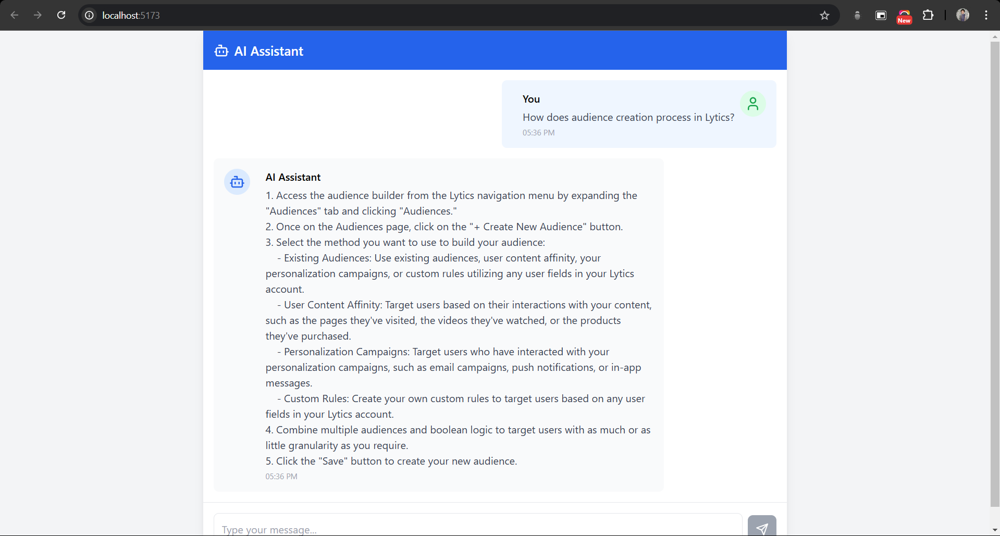

# Project: Flask Chatbot with LangChain and Google Generative AI

## Description

This project is a Flask-based chatbot application that utilizes LangChain, Google Generative AI, and Chroma for context-aware question answering. The chatbot processes user queries and provides detailed responses based on the context from uploaded text files.



## Features

- **Flask API**: A RESTful API for communication between the client and server.
- **LangChain Integration**: Supports advanced chaining for context-aware question answering.
- **Google Generative AI**: Uses the Gemini model for generating high-quality responses.
- **Text Processing**: Supports loading and splitting large text files into manageable chunks.
- **Vector Store**: Uses Chroma for efficient retrieval of relevant documents.
- **CORS Support**: Enables interaction with a React frontend or other clients.

## Installation

### Prerequisites

- Python 3.9 or higher
- Flask
- Google Generative AI API key
- node package manager

### Steps

1. Clone the repository:

   ```bash
   git clone https://github.com/sathwikbalu/ChatBot.git
   cd ChatBot
   ```

2. Create and activate a virtual environment:

   ```bash
   python -m venv venv
   source venv/bin/activate   # On Windows: venv\Scripts\activate
   ```

3. Install the required dependencies:

   ```bash
   pip install -r requirements.txt
   ```

4. Start the Flask server:

   ```bash
   cd python
   python run.py
   ```

5. Navigate to the React frontend directory and start the development server:

   ```bash
   cd frontend
   npm run dev
   ```

## Endpoints

### `POST /chat`

- **Description**: Processes user messages and returns a detailed response based on the context.
- **Request Body** (JSON):
  ```json
  {
    "message": "Your question here"
  }
  ```
- **Response** (JSON):
  ```json
  {
    "response": "Generated answer here"
  }
  ```

## Folder Structure

```
project-root/
|-- data/                    # Directory for input text files
|-- venv/                    # Python virtual environment (ignored in .gitignore)
|-- run.py                   # Main Flask application
|-- requirements.txt         # Project dependencies
|-- .gitignore               # Git ignore file
|-- frontend/                # React frontend source code
```

## Usage

1. Place your text files in the `data` directory.
2. Start the Flask server by running `python run.py`.
3. Navigate to the `frontend` directory and start the React development server with `npm run dev`.
4. Interact with the chatbot via the React frontend or by sending POST requests to `http://localhost:7000/chat` with a `message` in the body.

## Notes

- Ensure your Google Generative AI API key has sufficient permissions.
- The `venv` directory is ignored in `.gitignore` to prevent it from being tracked by Git.
